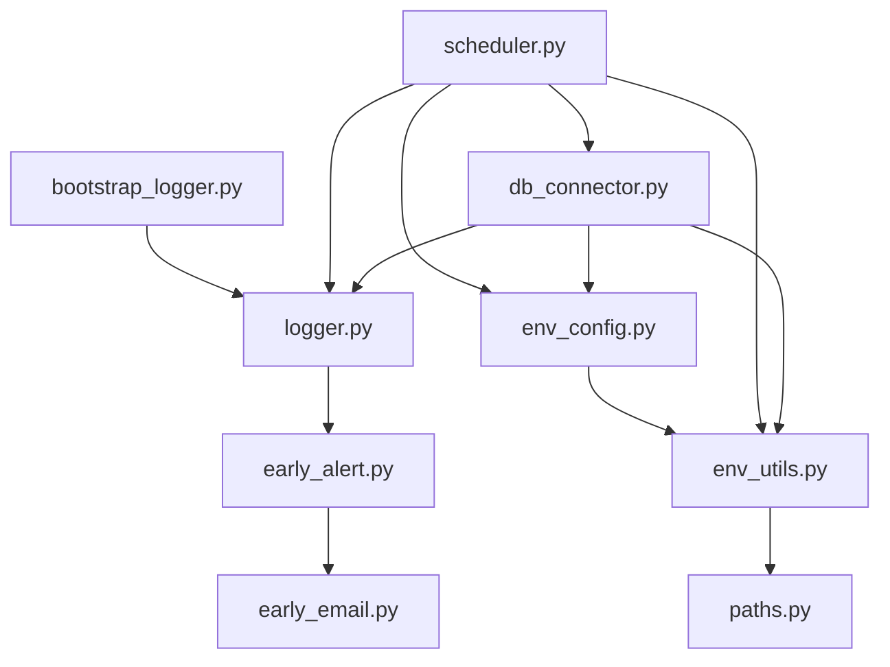

# db_utils - Shared Utilities for Database Operations

This directory contains reusable utility modules for database interactions, environment configuration, logging, and scheduling tasks. These utilities are designed to support multiple programs in the ELT pipeline and make common operations easier, safer, and consistent.

## Contents

### 1. `bootstrap_logger.py`
Provides initialization of a base logger. Used to bootstrap logging before other modules or main programs initialize their own logger instances.

**Usage Example:**
```python
from db_utils.bootstrap_logger import bootstrap_logger

logger = bootstrap_logger("MyProgram")
logger.info("Logger initialized")
```
### 2. `db_connector.py`

Handles database connections for Oracle and SQL Server. Includes helper functions to open and close connections safely.

**Key Functions:**

- `get_db_connection(environment, db_name, logger=None)`:  
  Opens a connection to the specified database in the given environment. Returns a connection object.

**Usage Example:**
```python
from db_utils.db_connector import get_db_connection

# Connect to CSRPT database in DEV environment
conn = get_db_connection("DEV", "CSRPT", logger)
cursor = conn.cursor()
cursor.execute("SELECT * FROM my_table")
rows = cursor.fetchall()
cursor.close()
conn.close()
```
### 3. `early_alert.py`

Provides utilities for generating early alerts when a problem or exception occurs in the system. Typically used for monitoring long-running ETL processes or critical jobs.

**Key Functions:**

- `send_alert(subject, message, logger=None)`:  
  Sends an early alert (e.g., email or log) with the given subject and message.

- `alert_on_crash(logger)`:  
  Decorator that wraps a function and triggers an alert if the function raises an exception. Logs the exception details.

**Usage Example:**
```python
from db_utils.early_alert import alert_on_crash

@alert_on_crash(logger)
def critical_task():
    # your critical code here
    pass
```
### 4. `early_email.py`

Provides utilities for sending early warning emails for failures, important events, or monitoring purposes.

**Key Functions:**

- `send_email(subject, body, to_addresses, logger=None)`:  
  Sends an email with the specified subject and body to the provided list of recipients. Logs success or failure if a logger is provided.

- `email_on_exception(to_addresses, logger=None)`:  
  Decorator that wraps a function and sends an email notification if an exception occurs during its execution.

**Usage Example:**
```python
from db_utils.early_email import email_on_exception

@email_on_exception(to_addresses=["team@example.com"], logger=logger)
def run_critical_job():
    # your critical code here
    pass
```
### 5. `env_config.py`

Handles environment configuration, loading, and parsing for ETL and database operations.

**Key Functions:**

- `parse_run_environment_from_args()`:  
  Parses command-line arguments to determine which environment (e.g., DEV, QA, PROD) to run in.

- `load_environment_dotenv(run_env, logger=None)`:  
  Loads environment-specific `.env` files and sets environment variables accordingly.  
  Logs any issues if a logger is provided.

- `load_config(logger, run_env)`:  
  Loads YAML or other configuration files for database connections, table metadata, or other settings based on the selected environment.  
  Returns configuration dictionaries and additional context needed by the application.

**Usage Example:**
```python
from db_utils.env_config import load_environment_dotenv, load_config

run_env = "DEV"
load_environment_dotenv(run_env, logger=logger)
_, configDB, _ = load_config(logger, run_env)
```
### 6. `env_utils.py`

Provides utility functions for handling environment-related tasks and helper operations.

**Key Functions:**

- `get_env_var(name, default=None)`:  
  Retrieves an environment variable by name. Returns `default` if the variable is not set.

- `set_env_var(name, value)`:  
  Sets an environment variable in the current process.

- `validate_env(run_env)`:  
  Checks if the provided environment string is valid (e.g., DEV, QA, PROD) and raises an exception if not.

- `expand_path(path)`:  
  Expands environment variables and user paths (`~`) for file system operations.

**Usage Example:**
```python
from db_utils.env_utils import get_env_var, set_env_var

db_host = get_env_var("DB_HOST", default="localhost")
set_env_var("RUN_ENV", "DEV")
```
### 7. `logger.py`

Provides logging utilities and decorators for consistent logging and error handling across scripts.

**Key Components:**

- `get_logger(name, run_env)`:  
  Returns a configured logger instance for the given script/module name and environment.

- `alert_on_crash(logger)`:  
  A decorator to wrap main functions or tasks to catch exceptions, log them, and optionally trigger alerts (e.g., email, Slack).

- `log_with_context(logger, message, context=None)`:  
  Helper function to log messages with optional context information for easier debugging.

**Usage Example:**
```python
from db_utils.logger import get_logger, alert_on_crash

logger = get_logger("MyScript", run_env="DEV")

@alert_on_crash(logger)
def main_task():
    logger.info("Starting task...")
    # task logic here
```
### 8. `paths.py`

Provides utilities for managing file paths, directories, and environment-specific paths.

**Key Components:**

- `get_base_path()`:  
  Returns the base project directory path, typically used as a reference point for other relative paths.

- `get_data_path(run_env)`:  
  Returns environment-specific data directory paths, e.g., `DEV`, `TEST`, `PROD`.

- `ensure_dir(path)`:  
  Creates the directory if it does not already exist.

- `resolve_path(*args)`:  
  Joins multiple path components safely and returns an absolute path.

**Usage Example:**
```python
from db_utils.paths import get_data_path, ensure_dir

data_dir = get_data_path("DEV")
ensure_dir(data_dir)

file_path = resolve_path(data_dir, "myfile.csv")
```
### 9. `scheduler.py`

Adaptive concurrency scheduler for running tasks in parallel using threads or processes.

**Key Features:**

- Dynamically adjusts worker pool size based on recent task durations.
- Supports both `ThreadPoolExecutor` and `ProcessPoolExecutor` via a simple toggle (`use_processes=True/False`).
- Keeps task execution durations for adaptive scaling.
- Provides a consistent return structure for tasks: `(task_name, elapsed_time, row_count)`.

**Initialization:**
```python
from db_utils.scheduler import AdaptiveScheduler

scheduler = AdaptiveScheduler(
    max_workers=8,      # maximum concurrent workers
    min_workers=2,      # minimum concurrent workers
    adjust_interval=60, # seconds between scaling adjustments
    logger=logger,      # optional logger
    use_processes=False # toggle between threads and processes
)
```
Here’s a properly formatted Markdown version of your notes:

***

# Notes

- All modules are designed to be reusable across multiple ELT programs.
- The `scheduler.py` module is ideal for parallelizing table loads or other CPU/IO-bound tasks.
- Logging is consistent across modules when using `logger.py` or `bootstrap_logger.py`.
- Configuration is centralized via `env_config.py` and `.env` files.

***

# Suggested Usage

1. Load environment settings
```python
from db_utils.env_config import load_environment_dotenv
load_environment_dotenv("DEV")
```
2. Get a logger
```python
from db_utils.logger import get_logger
logger = get_logger("MyProgram", "DEV")
```
3. Use database connections
```python
from db_utils.db_connector import get_db_connection
conn = get_db_connection("DEV", "CSRPT", logger)
```
4. Run tasks with adaptive scheduling
```python
from db_utils.scheduler import AdaptiveScheduler
scheduler = AdaptiveScheduler(max_workers=8, min_workers=2, logger=logger, use_processes=False)
results = scheduler.submit_tasks(tasks)
```

***
Shared database utility modules used across ETL/ELT jobs.  
This package centralizes logging, environment configuration, database connections, and job orchestration (scheduler).

---

## 📊 Module Dependency Diagram



---

## 📋 Module Relationships

| Module               | Purpose                                                                 | Depends On                                    | Used By                        |
|-----------------------|-------------------------------------------------------------------------|-----------------------------------------------|--------------------------------|
| **bootstrap_logger.py** | Creates a logger quickly for bootstrap/init scripts                    | `logger.py`                                   | Dev setup, init scripts         |
| **logger.py**          | Centralized logging setup with formatting & context support             | –                                             | `scheduler.py`, `db_connector.py`, `early_alert.py` |
| **early_alert.py**     | Triggers alerts when jobs crash or fail                                 | `logger.py`, `early_email.py`                 | `scheduler.py`, main programs   |
| **early_email.py**     | Sends alert emails (SMTP, templates, etc.)                              | –                                             | `early_alert.py`                |
| **env_config.py**      | Loads environment YAML & .env files                                    | –                                             | `env_utils.py`, `db_connector.py`, `scheduler.py` |
| **env_utils.py**       | Helpers for resolving env paths & variables                            | `env_config.py`, `paths.py`                   | `db_connector.py`, `scheduler.py` |
| **paths.py**           | Central place for filesystem path resolution                           | –                                             | `env_utils.py`                  |
| **db_connector.py**    | Opens SQL Server / Oracle connections, returns cursor/connection        | `env_utils.py`, `env_config.py`, `logger.py`  | ETL jobs, `scheduler.py`        |
| **scheduler.py**       | Adaptive job scheduler (thread/process pools, retry, adaptive scaling) | `logger.py`, `db_connector.py`, `env_utils.py`| ETL jobs, reusable orchestration |

---

## 🚀 Usage

1. Import utilities into your ETL/ELT scripts:

```python
from db_utils.logger import get_logger
from db_utils.db_connector import get_db_connection
from db_utils.scheduler import AdaptiveScheduler
```

2. Adjust `scheduler.py` settings (`max_workers`, `use_processes`, etc.) depending on workload.
3. Keep all shared modules in this directory so updates are automatically available across jobs.